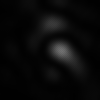

<h1> Deep Learning Library for Labview/C++</h1>

Deep Learning library in Labview. C++-based implementation of a feed-forward neural network.  
Compilation requires version 3.3.5. of the Eigen library. Compiled with VisualStudio C++ 2015.

The library currently supports 
<pre>
1. Multi-feature Convolutional Layers with sidechannels (unstructured inputs that are simply passed on)
2. Multi-feature Deconvolutional Layers with sidechannels 
3. Dense Layers 
4. Dropout Layers
5. Max-Pooling Layers
6. Pass-On Layers (apply some elementwise function)
7. Mixture Density Layer (Probability distribution of likely output values)
9. Layer sharing between networks
10. Vanilla GAN-training functions
</pre>
with three different non-linearities ReLu, Tanh and Sigmoid (can be different for each layer).

Gradient descent is performed in minibatches and several methods are available

<pre>
1. Momentum-based descent (Nesterov's accelerated gradient currently commented out for technical reasons).
2. Conjugate Gradient 
3. ADAM 
</pre>

Furhthermore, the library offers weight normalisation (irrespective of gradient-descent method).

All methods can be turned on and off dynamically during the training. All hyperparameters can always be changed during the training.
 
Currently I apply this to "inverse-holography".
More about that below..

<h2> HoloNet - Teaching Neural Networks how to do Holography</h2>

For my research, I need to be able to create complicated light patterns in my holographic optical tweezer setup (see e.g. Dynamic holographic optical tweezers, Curtis et al, 2002).
My setup features a so-called spatial light modulator (SLM), essentially a liquid crystal screen with 800x600 pixels. Each pixel can advance or delay the phase of the incoming laser beam.
In theory, this should allow me to shape the beam in any way I want. In practice, I need to know which value I should assign to each pixel of this SLM to create that particular beam shape.

That is not a simple problem. In fact, its non-trivial enough, that there are mountains of literature about it (there always are).
 
I thought that deep learning might be one way to solve this problem. We should be able to train a neural network on the forward problem (Hologram to Intensity).

Mathematically speaking, the transformation we wish to train our network on is a non-linear matrix-to-matrix problem. Our images are intensity only, so no additional colour channels.
The transformation that the SLM imparts on the beam cannot be written down in any analytical form and even if this was possible, it would require precise knowledge of the geometry of the setup. 

The following pictures should give you an impression of the transformation. You see pictures of the hologram with lots of striped patterns (left) and pictures of the corresponding laser light intensity fields (right), which can be pretty nice to look at.

My results so far are encouraging. A convolutional network trained on the forward problem (Hologram -> Intensity), indeed predicts the laser light field correctly most of the time. Interestingly, the filters in the first convolutional layer actually converge to some sort of spatial frequency filter, as I had hoped.

When you follow the link below, you will see a video with a non-cherry picked selection of predictions (left) from the input hologram (bottom) and the actual intensity field, that I recorded (right).

<h2> Inverse Holography (Phase Retrieval) using Mixture-Density Convolutional Networks </h2>

The next challenge is to inversely "predict" the hologram from its own intensity field. This is an [inverse problem](https://en.wikipedia.org/wiki/Inverse_problem) and, unfortunately, it is "ill-posed", since there are many holograms that should give rise to the same or a very similar intensity fields (optical aberrations that destroy this theoretical invariance might save us, but that is not yet clear).

I am currently trying to tackle this problem using Mixture-Density networks (see [C Bishop 1994](https://www.microsoft.com/en-us/research/wp-content/uploads/2016/02/bishop-ncrg-94-004.pdf)).

UPDATE:
It it is probably hopeless to learn the holograms directly. Instead, I chose a different approach. The network is trained in fourier space, which is much lower in dimensionality and captures the essential information of the holograms.
This also solves on my biggest headaches, which was the so-called 'phase problem': Two holograms that only differ in a global phase will produce the same intensity distribution. The mapping of holograms -> Intensity is not injective.

UPDATE2: As Bishop writes in his book, Mixture Density models run into problems when the problem is invariant over not just a single branch of a function (like the inverse of x^2), but over a manifold of higher dimensionality (like r^2 = x^2 + y^2). This probably explains why mixture density approaches do not work for dimensions higher than 4x4.

<h2> Much better - Conditional (Wasserstein) GAN's for inverse problems </h2>
A much better approach to learning the input distribution for inverse problems is to train a conditional generative adversarial network (see https://arxiv.org/pdf/1811.05910.pdf) on the problem. The idea is to condition both the critic and the generator on the output of the setup (the intensity) and ask the generator for a possible input that might have lead to this output.

We had this idea here in Cambridge a couple of months ago ;) (seriously), but it got published in the mean time ->  https://arxiv.org/pdf/1811.05910.pdf

for CT data (which is another famous inverse problem).

The inverse GAN approach works really well on all toy problems that I could conceive of, but it seems difficult to train the GAN's on my holography data. That's probably why the guys from Sweden used Wasserstein GAN's and trained them with gradient penalty.

Gradient penalty is almost impossible to implement without automatic differentiation though. I will therefore have to train the network using tensorflow and then export the graph into a format that allows me to transfer it to my network here, so that I can actually produce holograms.
