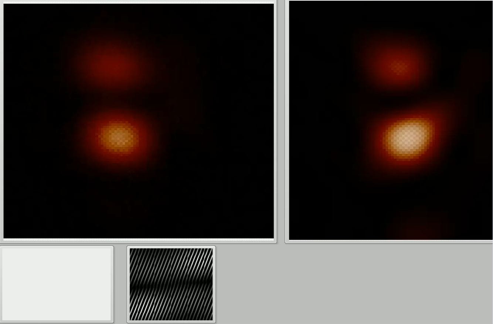

<h1> Deep Learning Library for Labview/C++</h1>

Deep Learning library in Labview. C++-based implementation of a feed-forward neural network.  
Compilation requires version 3.3.5. of the Eigen library.  
Additional Mixture Density Capability to deal with ill-posed inverse problems. 
Currently applied to inverse-holography (infer back on the hologram from the light field it creates).
More about that below..

<h2> HoloNet - Teaching Neural Networks how to do Holography</h2>

For my research, I need to be able to create complicated light patterns in my holographic optical tweezer setup (see e.g. Dynamic holographic optical tweezers, Curtis et al, 2002).
My setup features a so-called spatial light modulator (SLM), essentially a liquid crystal screen with 800x600 pixels. Each pixel can advance or delay the phase of the incoming laser beam.
In theory, this should allow me to shape the beam in any way I want. In practice, I need to know which value I should assign to each pixel of this SLM to create that particular beam shape.

That is not a simple problem. In fact, its non-trivial enough, that there are mountains of literature about it (there always are).
 
I thought that deep learning might be one way to solve this problem. We should be able to train a neural network on the forward problem (Hologram to Intensity).

Mathematically speaking, the transformation we wish to train our network on is a matrix-to-matrix problem. Our images are intensity only, so no additional colour channels.
The transformation that the SLM imparts on the beam cannot be written down in any analytical form and even if this was possible, it would require precise knowledge of the geometry of the setup. 

The following pictures should give you an impression of the transformation. You see pictures of the hologram with lots of striped patterns (left) and pictures of the corresponding laser light intensity fields (right), which can be pretty nice to look at.

My results so far are encouraging. A convolutional network trained on the forward problem (Hologram -> Intensity), indeed predicts the laser light field correctly most of the time.

When you follow the link below, you will see a video with a non-cherry picked selection of predictions (left) from the input hologram (bottom) and the actual intensity field, that I recorded (right).

The next challenge is to inverse "predict" the hologram from its intensity field. This is an [inverse problem](https://en.wikipedia.org/wiki/Inverse_problem) and, unfortunately, it is "ill-posed", since there are many holograms that should give to the same or very similar intensity fields (aberrations that destroy this theoretical invariance might help us).

I am trying currently to tackle this problem using Mixture-Density networks (see [C Bishop 1994](https://www.microsoft.com/en-us/research/wp-content/uploads/2016/02/bishop-ncrg-94-004.pdf)).

Once I have more results, I will post them here.

